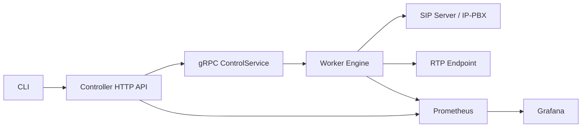
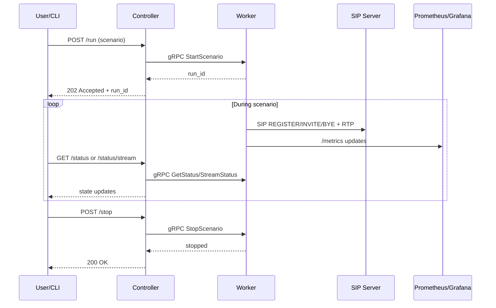

# Архитектура приложения

## Компоненты и связи

## Логические модули
- `cmd/cli` — запуск/остановка сценариев, запрос статуса и поток статуса.
- `cmd/controller` — HTTP API для пользователя, gRPC-клиент к worker.
- `cmd/worker` — gRPC сервер управления, HTTP `/metrics` и `/debug/pprof`.
- `internal/worker` — ядро генерации SIP/RTP, FSM вызова, ретраи/таймауты.
- `internal/sip` — сборка/парсинг SIP, Digest-auth.
- `internal/metrics` — публикация counters/gauges/histograms.
- `internal/qos` и `internal/rtp` — оценка MOS и генерация RTP.

## Поток выполнения сценария

